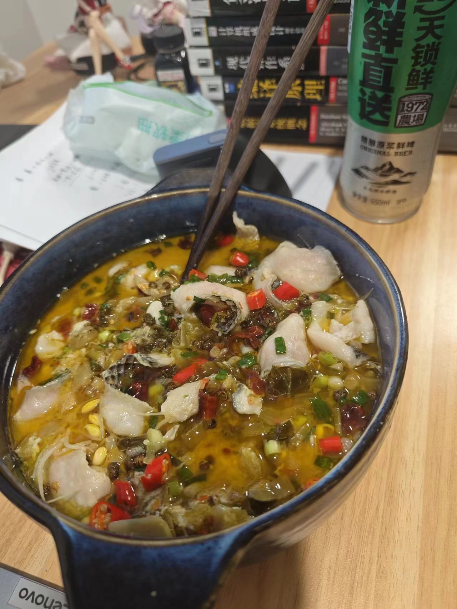

## 酸菜鱼

https://www.bilibili.com/video/BV1ra4y1J7G6/?spm_id_from=333.337.search-card.all.click&vd_source=61a6009cd67e5c5a770d61558317636a

材料：黑鱼片、鸡蛋、淀粉、盐、酸菜、泡椒、四川泡菜（仔姜）、大葱、姜、大蒜、干辣椒、青花椒、浓汤宝（猪骨）、芝麻油

## 准备
1. 酸菜洗净，焯水后煸干
2. 葱姜蒜，切末
3. 泡椒，泡菜切段
4. 青花椒和干辣椒炒一些，炒完后，干辣椒切段
5. 鱼加入盐、白胡椒粉、淀粉、香油/芝麻油（少量）拌匀后加入蛋清，拌匀后加入少量食用油静置

## 炒菜
1. 油下锅，加入葱姜蒜末，炒香
2. 加入泡椒段，泡菜段，炒香
3. 加入酸菜，炒一会（1min）
4. 加入热水，浓汤宝
5. 煮沸后，煮5-10min左右
6. 捞出酸菜，铺入碗底
7. 加入腌制的鱼片，煮至汤汁沸腾后出锅
8. 在碗中放入炒后的青花椒和干辣椒段
9. 锅中放入油（多一些）后加热，然后浇在碗中的青花椒和干辣椒上

## 备注

1. 如果想加入其他辅菜，可以热水焯一下，一开始直接铺在碗下面
2. 浓汤包也可以用骨头汤和鱼骨汤（鱼切片剩下的骨头，鱼头）代替（需要调一下味道，加盐味精）
3. 最后浇热油的地方，也可以加一点葱姜蒜末、小葱末一起浇热油

